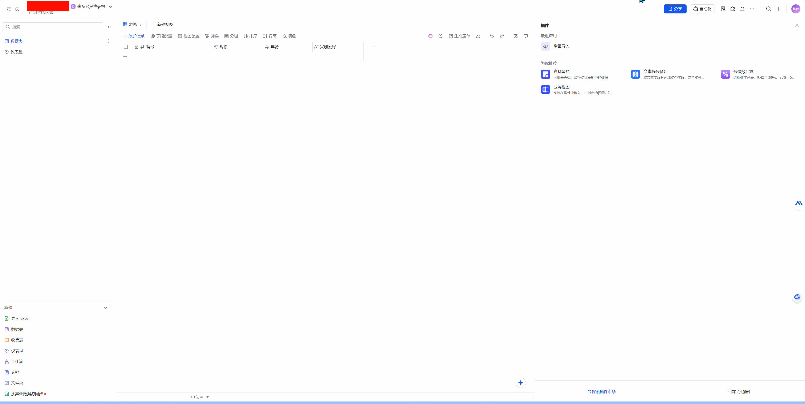
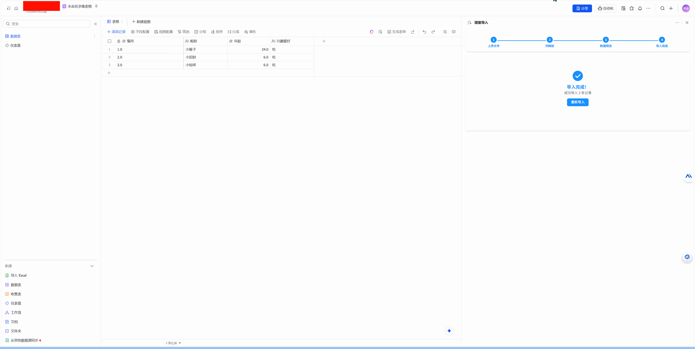

# 飞书多维表格 Excel 导入插件

## 👨‍💻 作者：小猴子

如果觉得本项目对你有帮助，欢迎点个 ⭐Star 支持一下！

## 📖 项目简介
这是一个 **飞书多维表格边栏插件**，用于将 Excel 文件数据高效导入到当前多维表格中。  
插件支持列映射、数据预览、分批导入和错误提示，能够大幅提升 Excel 数据迁移的效率和体验。

## ✨ 功能特性

- **文件上传**
    - 支持 `.xlsx`、`.xls`、`.csv`
    - 文件大小限制 20MB
    - 支持拖拽/点击上传

- **列映射**
    - 自动识别 Excel 表头和多维表格列名
    - 支持手动映射和跳过列
    - 防止重复映射

- **数据预览**
    - 显示前 10 行预览
    - 确认映射关系和数据格式

- **批量导入**
    - 自动分批处理（每批 200 条）
    - 实时显示导入进度
    - 统计成功/失败数量

## 🚀 功能演示

## 🛠 技术栈

- **框架**：Vue 3 + Vite + Element Plus
- **SDK**：飞书多维表格 JavaScript SDK
- **Excel 解析**：SheetJS (xlsx)
- **UI**：遵循飞书设计规范，优化边栏插件交互

## 发布
请先npm run build，连同dist目录一起提交，然后再填写表单：
[共享表单](https://feishu.feishu.cn/share/base/form/shrcnGFgOOsFGew3SDZHPhzkM0e)

## ⚠️ 注意事项

- 建议单次导入 ≤ 10,000 条数据
- 列数据类型需与多维表格保持一致
- 需要多维表格 **编辑权限**
- 大量数据导入请保持网络稳定

## 🐞 常见问题

- **文件解析失败** → 检查文件格式和完整性
- **列映射错误** → 确认选择了正确的对应关系
- **导入失败** → 检查表格列的数据类型是否匹配
- **网络错误** → 检查网络连接，重试导入

## ☕ 打赏支持

如果你希望支持作者的持续开发，可以请我喝杯咖啡 ☕ ~

  
  
微信/支付宝扫码打赏

---

### 📜 License
本项目基于 [MIT License](LICENSE) 开源。
